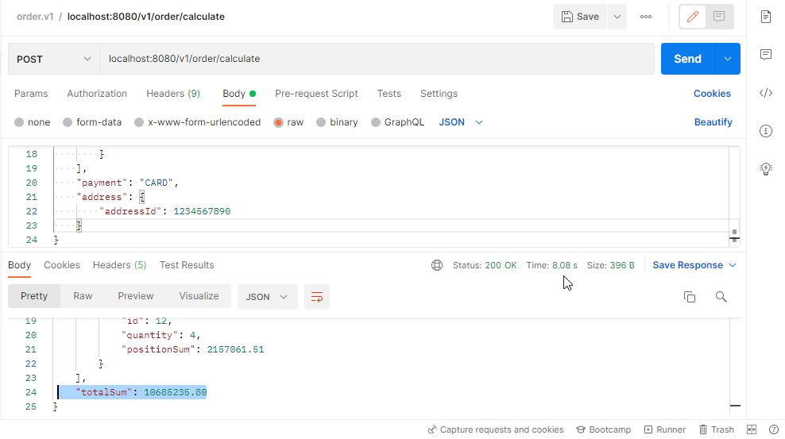

# Sandbox Microservice for Order Processing

### Tech stack

* Java 11, Spring Boot, JUnit5, 
* Mapstruct, Lombok 
* Gradle
* Swagger

### OpenAPI


* Swagger UI (http://localhost:8080/swagger-ui/index.html#/)
* api-docs (http://localhost:8080/v3/api-docs/)

### Attention 

```Thread.sleep(2000)``` was added for demonstration of the proper cache processing.

### Request example

```{
    "cart": [
        {
            "id": 12345,
            "quantity": 12
        },
        {
            "id": 1234,
            "quantity": 8
        },
        {
            "id": 123,
            "quantity": 4
        },
        {
            "id": 12,
            "quantity": 2
        }
    ],
    "payment": "CARD",
    "address": {
        "addressId": 1234567890
    }
}
```

### Response example 
```
{
    "cart": [
        {
            "id": 12345,
            "quantity": 12,
            "positionSum": 1738500.83
        },
        {
            "id": 1234,
            "quantity": 8,
            "positionSum": 2926616.11
        },
        {
            "id": 123,
            "quantity": 4,
            "positionSum": 3863057.35
        },
        {
            "id": 12,
            "quantity": 2,
            "positionSum": 2157061.51
        }
    ],
    "totalSum": 10685235.80
}
```

### Request screenshots 

- Uncached request: 


- Cached request:
